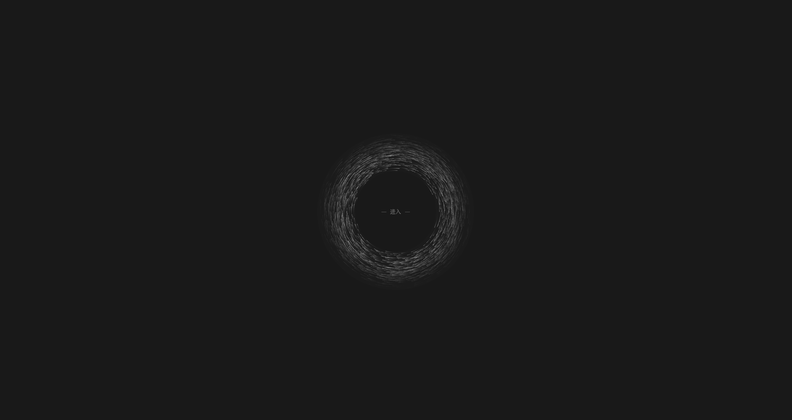
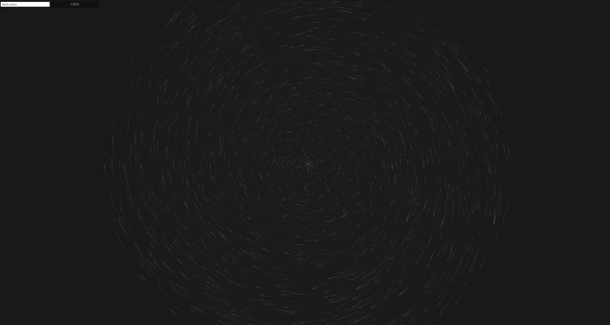

# BlackHole

> 这个小项目很懒，什么都没有介绍。

## TODO
* [x] 控制台建表
* [x] IP限制调用次数
* [x] 日志
* [ ] 多个表聚合统计分析
* [ ] 通知方式太差，抛弃req.flash
* [ ] 动画有点中二，要换一个

## Install
* mogodb redis服务均已开启 端口可在config目录下修改
* npm install || make install
* pm2 start index.js || make start
* pm2 kill || make stop

## ScreenShots

## API Docs
 /api/collect/:table GET  
|key | required | format |
|---- | ---  | ---|
|startDate | false | timestamp|    
|endDate |  false | timestamp|

 /api/collect/:table POST   
|key | required | format  |
|---- | ---  | ---  |
|content | true | at will  |

## LICENSE
MIT